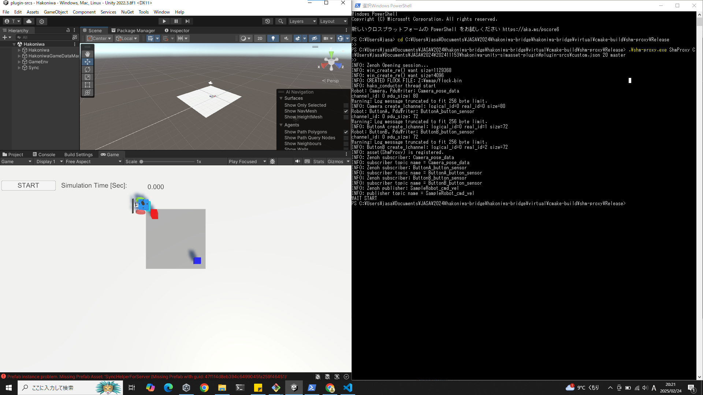

### 前提条件
1. Unity 2022.3.8f1をインストール済みであること
2. SHMProxyが実行できる状態である（このURLを参照　https://github.com/toppers/hakoniwa-bridge/blob/main/README-ja.md）

### 実施手順
リポジトリ https://github.com/y-kunii/jasa-unity-virtual-factory-model/tree/Fix-EdgeTech-2024
1. git clone https://github.com/y-kunii/jasa-unity-virtual-factory-model.git
2. git switch Fix-EdgeTech-2024
3. Unity Hubより「plugin-srcs」フォルダでUnityを立ち上げる

4. Hakoniwa.unityシーンを選択し、ダブルクリックでロードする（path：plugin-srcs/Assets/2024EdgeTech/Scene/Hakoniwa.unity）

5. Window/Hakoniwa/GenerateDebugよりcustom.jsonを生成

6. ５で生成したcustom.jsonを用いてShmProxyを立ち上げる

7. Unityのシミュレーション開始ボタンを押下

8. GameViewのSTARTボタンを押下し、開始する

### 操作方法
- ↑：前進 
- ↓：後進 
- →：右旋回 
- ←：左旋回 
- スペースキー：停止